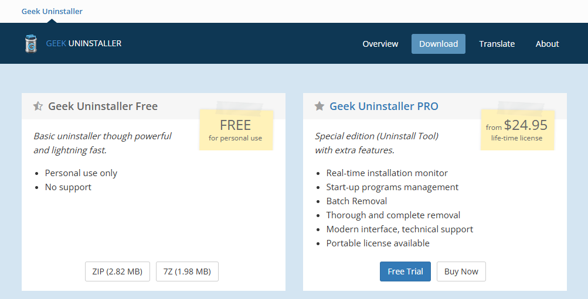

この記事ではWindowsの**システム容量を削減**する方法を６つ、紹介したいと思います。**容量が足りなくて困っている**、極限の環境でWindowsを使いたい方におすすめです。

## ターミナルの準備
まず、この作業では全般的に**ターミナル**を使用します。そのため、あらかじめ**ターミナルを起動**しておきましょう。まず、**「Windows+X」を同時押しするか、スタートボタンを右クリックします。**


「Windows PowerShell (管理者)」または「ターミナル (管理者)」をクリックします。この時、ユーザーのパスワードが必要になったりすることがあります。


この画面が表示されたら準備完了です。次のステップに行きましょう。

## 予約済み記憶域・休止ファイルの無効化
まず１つ目は、Windowsの**予約済み記憶域**、そして**休止ファイルの無効化**です。この工程で**10GB以上**の余裕を作ることができるかもしれません。

### 予約済み記憶域の無効化

予約済み記憶域とは、パソコンの容量が少ない時でも最新のバージョンに維持することができます。**しかし、それが影響でPCの容量を圧迫している場合があります。**

では無効化を行っていきましょう。[^1]

```powershell
DISM.exe /Online /Set-ReservedStorageState /State:Disabled
```
これを実行し、エラーが発生しない場合は成功です。これはエラーがない時の実行結果です。

```
PS C:\Users\user> DISM.exe /Online /Set-ReservedStorageState /State:Disabled

展開イメージのサービスと管理ツール
バージョン: 10.0.22621.2792

イメージのバージョン: 10.0.22631.4169

操作は正常に完了しました。
PS C:\Users\user>
```
しかし、**Windows Updateの途中**である場合、**無効にできない**ことがあります。

```txt
PS C:\Users\user> DISM.exe /Online /Set-ReservedStorageState /State:Disabled

展開イメージのサービスと管理ツール
バージョン: 10.0.22621.2792

イメージのバージョン: 10.0.22631.4169


エラー: 0x800f0975

予約済み記憶域が使用中の場合、この操作はサポートされません。
処理中のいずれかの操作が完了するのを待ってから、後でもう一度実行してください。

DISM ログ ファイルは C:\Windows\Logs\DISM\dism.log にあります
PS C:\Users\user> 
```

その場合は、Windows Updateが終わったことを確認してから行うか、**再起動**をするなどの対処法を行ってから再度実行してください。

### 休止ファイルの無効化

休止ファイルとは、パソコンの作業中のデータを紛失しないまま電源を切るときに使われるものです。例えば、Wordファイルを保存しないままパソコンの電源を落とすときに使えます。**しかし、環境によっては大きな容量の圧迫を招きます。**

では休止ファイルを無効にしていきます。[^2]

```powershell
powercfg.exe /hibernate off
```

これを実行し、エラーが発生しなかった場合は完了です。

```txt
PS C:\Users\user> powercfg.exe /hibernate off
PS C:\Users\user>
```
何も表示されずに完了しますが、再起動をすることなく、容量を開けることができます。エラーが発生した場合は、PCを**再起動**してからもう一度お試しください。

## WinSxSの圧縮
WinSxSというものを圧縮する作業に移ります。この工程で**5GB**程空けることができるかもしれません。

WinSxSとは、Windowsシステムで使う機能の管理を司っており、これがあることでWindowsのアップデートやパッケージ(機能等)の有効・無効を切り替えたりすることができます。このWinSxSはユーザーがむやみに変更すると**Windowsが起動しなくなる危険性**があります。[^3]

ですが、そのWinSxSのデータを正しく整理してくれるコマンドがあるので、紹介します。次のコマンドを先ほどのターミナルに入力します。[^4]

```powershell
Dism.exe /online /Cleanup-Image /StartComponentCleanup /ResetBase
```
これを実行すると、５分ほど待たされたのち、「操作が完了しました。」と表示され、容量が削減されるかと思います。

```txt
PS C:\Users\user> Dism.exe /online /Cleanup-Image /StartComponentCleanup /ResetBase

展開イメージのサービスと管理ツール
バージョン: 10.0.22621.2792

イメージのバージョン: 10.0.22631.4169

[=====                    10.0%                         ]

[========================100.0%=========================]
操作は正常に完了しました。
PS C:\Users\user>
```

これでWinSxSの圧縮は完了です。
## Windowsフォルダの圧縮
ここからは少々脳筋と表現しても過言ではない作業ですが、Windowsフォルダをとある機能を使って圧縮したいと思います。それは「**NTFS圧縮**」といい、Windowsのストレージ管理が提供する機能で、**zipにすることなく容量を圧縮できるもの**です。それを今回はWindowsにかけていきます。

では、次のコマンドを入力します。

```txt
cd c:\windows

compact /c /s:c:\windows /a /i /f /q /EXE:LZX
```
これを実行すると、圧縮処理が開始されます。この時、**かなりの時間を要します**が、気長に待ちましょう。

```txt
...

c:\windows\Branding のファイルを圧縮しています

c:\windows\BrowserCore のファイルを圧縮しています

c:\windows\CbsTemp のファイルを圧縮しています

c:\windows\Containers のファイルを圧縮しています

c:\windows\CSC のファイルを圧縮しています

c:\windows\Cursors のファイルを圧縮しています

...
```

まるでウィルスのような見た目をしているかと思いますが、支障はありませんのでご安心ください。ですがこの処理が終わった後、**性能が極端に低いマシン**だと、**多少重くなるなどの挙動**が見られるかもしれません。様子次第でこのコマンドを実行しましょう。

## 仮想メモリの最適化
仮想メモリはWindowsのリソース(アプリの同時起動可能な割合)が不足した時に役立つものですが、それが影響でディスク使用率が不足する恐れがあります。通常は必要ですし、緊急時に仮想メモリのおかげでPCのパフォーマンスを維持させることも出来ますが、容量の改善をしたい場合は、ぜひこの工程を行ってください。

まず、この作業では「設定」アプリを使います。「Windowsキー」または「スタート」ボタンから検索で「設定」と入力し、設定を開きましょう。


そして、「システム」>「バージョン情報」>「デバイスの仕様」>「システムの詳細設定」まで開き、次の「システムのプロパティ」が表示されることを確認します。


次に「パフォーマンス」欄の設定ボタンを押します。すると「パフォーマンス オプション」ウィンドウが表示されます。


そして「詳細設定」>「仮想メモリ」欄の変更ボタンを押し、次の「仮想メモリ」が表示されることを確認します。


もし「すべてのドライブのページング ファイルのサイズを自動的に管理する(A)」にチェックが入っている場合は作業ができないので、チェックをオフにしましょう。

次に「各ドライブのページング ファイルのサイズ」欄の中にある「C」をクリックします。その時、下側で「システム管理サイズ(Y)」が有効になっていた場合、「カスタム サイズ(C)」に変更してください。

初期サイズと最大サイズを変更します。初期サイズは「800」と入力してください。最大サイズは「空き領域」より小さい値を入力してください。推奨は空き領域ギリギリの数値です。例えば空き領域が「64251 MB」と出ている場合、「64250」と最大サイズに入力します。

ここまで出来たら「設定(S)」を押します。この時に「OK」を押してしまうと変更が反映されないので、順番を間違えないでください。「設定(S)」ボタンを押した後に「OK」を押し、「パフォーマンス オプション」ウィンドウもOKを押して閉じ、「システムのプロパティ」ウィンドウもOKを押します。すると、再起動を促すポップアップが出るはずです。出た場合は再起動を選んでください。出ない場合は通常再起動は不要です。ですが、まれに設定が完了できていないことでポップアップが出ない可能性があるので、一度確認をすることをおすすめします。

設定は終了です。これで空き容量が平均6～8GB空いたはずです。

## Geek Uninstaller
これに関してはほぼ脳筋となります。この作業ではWindowsにインストールされているアプリで**必要のないものを削除していく**というものです。ですが、初心者には**お勧めできません**ので、**決して甘い考えで行わないでください。**

### 初心者向け
Geek Uninstallerは初心者やパソコンの知識が乏しい方、システムの理解が浅い方にはお勧めしていません。そのため、Geek Uninstallerより安全な方法をご紹介します。

#### 設定アプリ
一番わかりやすいのは設定アプリからアプリを削除する方法です。

### 本編
この作業では「Geek Uninstaller」を使用します。

Geek Uninstallerの最大のメリットは「消しきれなかったデータを見逃さない」ことです。ただし、それが悪さをして必要なデータまで削除してしまう可能性がありますので、使う場合は慎重に削除する内容を確認してください。

#### ダウンロード
まずは[geekuninstaller.com ダウンロードページ](https://geekuninstaller.com/download)を開いてください。



ここから左側の「zip」をクリックしてダウンロードします。日本語訳は以下です。


ダウンロードが終わったら、そのzipを解答し、フォルダ内のgeek.exeを実行します。すると次の画面が現れます。


僕の環境ではこれらがインストールされていましたが、例えば

- ドライバ
- サービス
- アップデーター
- その他PCメンテナンスアプリ

は削除を回避したい部類です。

#### デスクトップ アプリ
先ほどの画面は「デスクトップ アプリ」といい、Microsoft Storeからインストールしていないものをさします。

Geek Uninstallerを使いたくない場合は、コントロールパネルや設定アプリ、アプリ独自のアンインストールexeを利用して削除を行いましょう。

削除する場合は、該当するアプリケーションを右クリックすると


この一覧が出るので「アンインストール」をクリックします。すると、そのアプリ独自のアンインストールの案内が出るので、作業を行い削除してください。まれに出ない場合があります。

そして、アンインストールが完了すると、次の画面が現れます。


ここで必要なデータが含まれていないかチェックし、必要がないものを削除していきます。しかし、初心者の場合はむやみに削除するのはお勧めしません。もしここを「とりあえず削除したい」のであれば、クリーンインストールを行う知識を身に着け、クリーンインストール後のWindowsで行うようにしてください。

#### Microsoft Store Apps
「Microsoft Store Apps」とは名前の通り、Microsoft Storeからダウンロードしたアプリを指します。そのアプリもGeek Uninstallerで削除することが可能です。

「表示」>「Microsoft Store Apps」から一覧の切り替えが可能です。


ちなみに、Microsoft Store Appsの一覧はこのようになっています。


ここはあなたがいらないと思うアプリを削除してください。しかし、次のアプリは少し削除を控えるべきです。

- App Installer
- ~ Video Extension
- ~ Image Extension
- Microsoft Store
- ~ メディア拡張機能
- ~ ビデオ拡張機能

これらのアプリはシステムで必要であったりすることが多いはずです。正しい判断を行えない場合は、とりあえずこれらのアプリは削除しないようにしましょう。

## 最後に
この記事をご覧いただきありがとうございました。Windowsは長期的に使っているうえで、アプリのインストール・アンインストールによってキャッシュが肥満化してきます。それらの原因を対処する方法を解説しました。この記事が気に入ったらこのサイトをブックマークしていただくか、[miharu.blog](https://miharu.blog)をブックマークしていただき、ほかの記事もぜひご覧ください。

## 参考文献
- [DISM 予約済み記憶域のコマンドライン オプション - Microsoft Learn][^1]

[^1]: https://learn.microsoft.com/ja-jp/windows-hardware/manufacture/desktop/dism-storage-reserve?view=windows-11

- [Windows を実行しているコンピューター上で休止状態を無効にする方法および再度有効にする方法 - Microsoft Learn][^2]

[^2]: https://learn.microsoft.com/ja-jp/troubleshoot/windows-client/setup-upgrade-and-drivers/disable-and-re-enable-hibernation

- [コンポーネント ストアの管理 - Microsoft Learn][^3]

[^3]: https://learn.microsoft.com/ja-jp/windows-hardware/manufacture/desktop/manage-the-component-store?view=windows-11

- [WinSxS フォルダーのクリーンアップ - Microsoft Learn][^4]

[^4]: https://learn.microsoft.com/ja-jp/windows-hardware/manufacture/desktop/clean-up-the-winsxs-folder?view=windows-11
