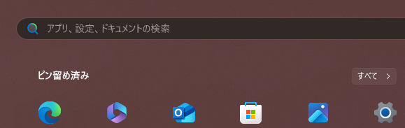
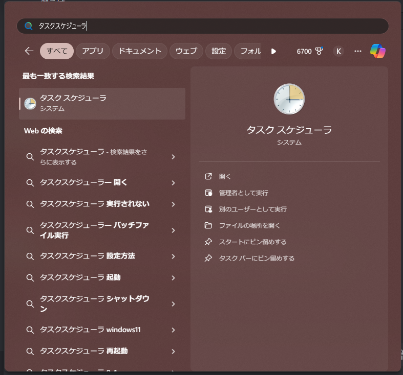
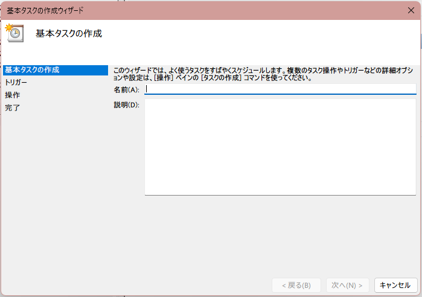
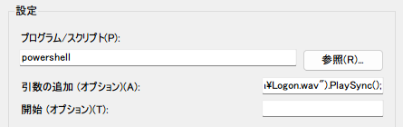

この記事では、Windows 11でログオン・ログオフの音を流す方法を紹介します。方法もとても簡単なので、ぜひ読んでいってください。Windows 11だけでなく、Windows 10やその他タスクスケジューラを利用できるWindowsであれば利用できるので、ぜひ応用してみてください。大雑把な解説が見たい場合は[まとめ](#まとめ)をご覧ください。

## タスクスケジューラー
この方法ではタスクスケジューラーを使う方法です。タスクスケジューラーは次の方法で開くことができます。

1. Windowsキーまたはスタートボタンを押す


2. 検索欄から「タスクスケジューラ」と打つ。注意として「タスクスケジューラー」ではない。


3. 先頭に出たタスクスケジューラをクリックする。この時、アイコンが違っている場合は、アプリではないものが開いてしまうので注意。

この方法でタスクスケジューラーを開けたら、次のステップです。

## タスクの作成
ここからはタスクを作成していきます。一つ一つ方法を説明していきます。

まず左にあるサイドバーの項目「タスクスケジューラ ライブラリ」をクリックします。


次に右側にある「基本タスクの作成...」をクリックします。

すると次の画面が現れます。


名前や説明を任意に設定し、次へをクリック。トリガーは「ログオン時」をクリックし、次へを押します。ちなみに、この選択肢は後々削除するので、自由に選択してかまいません。操作は何も変えず、「プログラムの開始」で次へを押します。するとプログラムの開始項目になるので、「プログラム/スクリプト」と「引数の追加」にそれぞれ内容を入力していきます。

プログラム/スクリプト項目には次を入力します。
```cmd
powershell
```

次に引数の追加項目にはこれを入力します。
```powershell
(New-Object Media.SoundPlayer "C:\Users\Public\Documents\Media\Logon.wav").PlaySync();
```


このような形で入力が完了したら、次へを押し、完了をクリックします。これでイベントの準備は完了です。

次に


## まとめ
