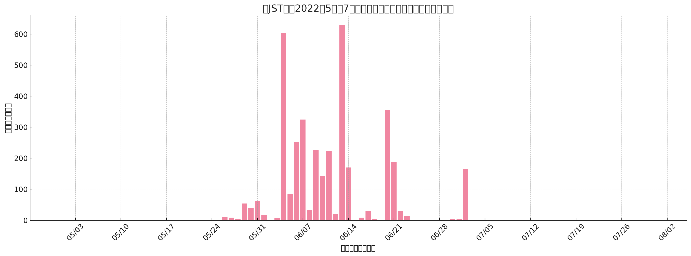
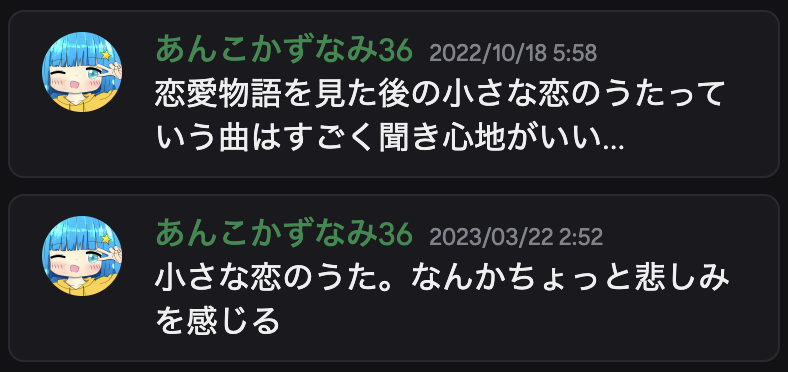
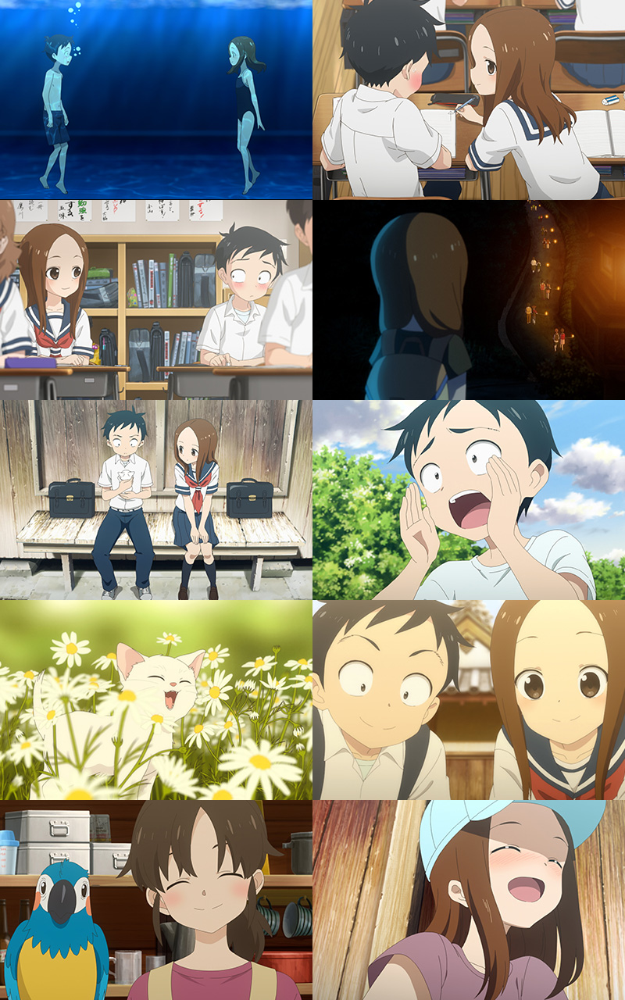

この記事をご覧くださりありがとうございます。この記事では高木さん、高橋李依さんなどが登場し、僕がどうやって出会ったのが、何が好きなのかなどを語る記事となっております。また、そこから「オリキャラを作ってみた！」に繋がる話も一部入っています。よかったらご覧ください。

この記事の元は[オリキャラを作ってみた！](https://www.miharu.blog/Novel/%E3%82%AA%E3%83%AA%E3%82%AD%E3%83%A3%E3%83%A9%E4%BD%9C%E3%81%A3%E3%81%A6%E3%81%BF%E3%81%9F%EF%BC%81%E3%83%9D%E3%83%BC%E3%82%BF%E3%83%AB/)からの記事です。よかったらこちらもご覧ください。

アニメオタクなどの話に悪寒がする人はこちらの記事は推奨されません。他の記事をご覧ください。

## 出会いから今までの歴史
高木さんや高橋李依さん、**がっこうぐらし**や**このすば**など、いろいろな作品に出会うまでのいろいろな経験を綴ってみました。

### からかい上手の高木さん
まず、出会ったきっかけです。僕は2022年にネッ友から大量のプレイリストをいただいたんですけど、その時に次の動画がありました。

[【MAD 】からかい上手の高木さん×空も飛べるはず　スキマスイッチ](https://youtu.be/rIdge4QLdQ0)

この動画、なぜか「からかい上手の高木さん」が使われてるんですよ。僕てっきりこのタイトルはその曲の名前なのかと思って、検索欄にアニメを入れてしまったんです。そしたら、出てきたのが「小さな恋のうた」という曲でした。

しかし、当時はまだあまり聞いていなかったんですが、大体何週間かしてから、何を思ったのか、**四六時中聞き出しました。**以下はSpotifyの再生数をグラフにしたデータです。



このグラフを元に、当時の僕が突然小さな恋のうたにハマったことがわかります。

しかし、当時の記憶はあくまで推測です。実は検索欄に本当に高木さんの名前を入れたのかどうかもわからない。本当に未知数です。でも、この出会いは本当に僕にとって感謝でしかありません。その理由を後述します。

### 小さな恋のうた
僕はこの曲を初めて聞いてから半年で、好きな曲であるという実感をしました。僕はよく独り言をDiscordで行なっているのですが、初めて「小さな恋のうた」と投稿したのは次の日付でした。



大体半年から1年です。なかなか好きな曲になっているようで、この独り言はまだプラベ雑談(要は隠し事するところ)に貼っていました。

ここから1年半までは、本当に一人で楽しむ曲でした。例えば、ストレスが溜まったり、落ち込んだりした時も、この曲を聴いていました。

そして、2023年からは学校に行っていた(とある都合で不登校時期があった)のですが、学校で「高木さん」という言葉を聴いて僕は思いました。

「え、高木さんってそんな有名なの...？」

当時の僕は過剰な反応を心の中でしがちで、ずばり<span title="本当に気持ち悪いですね。ごめんなさいね。">嫉妬してました。</span><span title="言い訳させてください。あのですね、当時の僕、高木さん大好き大好きだったんですよ。恋愛もしたことないのに、なんだか好きっていう。陰キャすぎてごめんけど、マジで好きだったんです。だから、当時は周りの人が自分の好きなキャラを知っているという現実が、すごくなんだかモヤモヤしたんですよ。でも、今はないからマジで許してくださいお願いします">(ｷｯｼｮ...)</span>なんて言っても当時は当時です。しかし、友達が言う高木さんとは、アニメのことです。なので友達はアニメの話をしたり、アニメの動画を見せたりしてくるんです。すると、僕は心の中で知っている高木さんとはギャップを感じるようになりました。例えば、当時はきっと、こんなふうに思ってました。
- かわいい
- 素敵な人
- 繊細な感情を持っているキャラ

実際も少しそう言ったそぶりがありますが、メインではありません。しかも当時はアニメに対して嫌悪感を抱いていました。なので高木さんというキャラを一人の人としてみていた当時の僕からすると、だいぶショックなものでした。

### 高木さんカバーソングコレクション
僕は小さな恋のうたをずっと聴いていましたが、大体2022年の10月あたりですぐにアルバムを覗きました。そこで最も好きだった曲をあげます。
- 気まぐれロマンティック
- 風吹けば恋
- 自転車
- 出逢った頃のように

でした。これらは今も定期的に聴いていますが、この中でも「風吹けば恋」「自転車」の方が好きです。

そして、これからさらに次の時期、大体2023年中旬で、突然また調べたんですよ。次はカバーソングコレクションの第二弾です。そこで今でも聴いている曲は
- あなたに
- 言わないけどね
- やさしい気持ち

でした。この中で「やさしい気持ち」はダントツきいています。小さな恋のうたと並ぶくらい好きです。今でもきいています。

YouTubeから聞くことも可能です。以下からどうぞ。これらは再生リストです。

[からかい上手の高木さん Cover song collection プレイリスト](https://youtube.com/playlist?list=PLzjZ0IWggC_YtvRaKiSqUS2_zo0HFokQO&si=T_-b3XdEQL6DFviE)

[からかい上手の高木さん Cover song collection 2 プレイリスト](https://youtube.com/playlist?list=OLAK5uy_ldn_LmjkOuxzcD2xRR4tEBWaYIxASKL-4&si=WzDKOq27BNe-vmnz)

### 高橋李依さん
僕は高木さんが好きなのか声が好きなのかわからないという状況が始まり、ついに次の段階に行きました。それが「声優さんを知る」です。

キャラが好きじゃないなら、声が好きなんだよ！と僕は感じたのです。なので、高橋李依さんの他の作品を調べてみます。すると...

<span class="big">声が...違いすぎる！</span>

そうなんです。声優さんって、すごいんです。演技が豊かなんです。全て僕の思っている声になるわけがありません。例えば「この素晴らしい世界に祝福を!」ではめぐみんというキャラが登場しますが、「え、そんな喋るの...この声で...！？」と思ったのが2024年です。ちなみに、色々と感じた点がありますが、後述します。

他にも、高橋李依さんが直接投稿している曲なんかは、思っている以上に大人っぽすぎて、衝撃を受けました。当時は全く違う印象だったので、ギャップが大きかったです。

なので声優さんへ依存するには性格も違うし、でも高木さんというキャラクターの印象も違う、僕は何が好きなんだと思いながら、小さな恋のうたを聞く人生を歩んでいました。

ちなみに、このすばについて、実は僕、高橋李依さんと検索するまで、めぐみんの声が高橋李依さんだと言うことを知りませんでした。知った当時は、こう思いました。

「え、え！？あの、めっちゃ有名な、めぐみんとかいうやつの声優って、あの高木さんの声優だったの！？！？高橋李依さんだったの！？！？」

他にも、高橋李依さんをWikipediaで見てみると、通称とかが書いてあって、なんだか別の世界にいるなあと、感じました。ファンはファンでしかないですね。

### がっこうぐらし
2025年2月、ふと思いました。

「高橋李依さんって他にどんなアニメ曲歌ってるんだろ。高木さんっぽいやつあったりしないかな。」

そう言って、Apple Musicで「高橋李依」と検索すると、すごい出るんです。でも、試聴してみると「ちょっとカッコよすぎ」「ちょっとギャップ」っていう意見が出ます。でも、これも高橋李依さんの声なんだなーって思いながら、めぐるのを楽しんでいたら、突如、いい歌を見つけました。それが「My Dream」です。そう、なんだか高木さんらしい曲として一番ハマったのはこの曲でした。

その曲を見つけた次の日、ふと「がっこうぐらし」という言葉を見て、「ん？懐かしい？」と感じました。そうです、僕は2015年当時、姉や兄がみるアニメを軽く視聴しており、当時のアニメの名前は頭に入っていたのです。なので、聴いたことのあるタイトルで、少し興味を持ちました。僕はAmazon Primeに加入してます。じゃあさ...見るしかないじゃん？

そこで、見てみました。朝から夜にかけて、ずーっと。思ったより時間が短くてびっくりしましたが、もうね、感動。泣いちゃう。そのアニメ見た後にMy Dream聞くと、思い出し泣きする。可哀想で強いキャラたちでした。頑張ってて、かっこよくて素敵なみんながすごいですよ。この曲は直紀美紀と言うキャラが歌っているのですが、すごいいいですよ。

そうして、My Dreamは定期的に聞く曲になりました。

### 山本崇一朗さん
僕は2025年2月を最後に高木さんや高橋李依さんに対する思いはもうキリがないとケジメをつけて、諦めて他のことをするようにしたんです。そこでやっていたのが「絵柄探し」でした。結果的に僕は生粋のロリコンであることがわかったのですが、順を追って説明します。

まず、僕はたくさんの絵柄を探っていきました。過去から今に至るまでに移った好きな絵柄はこんな感じです。
1. 線ががたがたで服が大きい女の子
2. クレヨンで書いたような絵
3. 「> <」とか「///」とかの表情がある絵
4. 「しぐれうい」さんみたいな絵柄
5. ショタみたいな、ボーイッシュな女子
6. 幼い顔つき・丸い目・３〜４頭身の男の子・女の子

最終的に理想像はあまりに高解像度なのですが、それはさておき、僕はこんな感じで絵柄を探ったのです。その時に、突如見つけたんです。その人が「山本崇一朗」さんでした。その人のさまざまなキャラは個性があって好きというか、すごくいいですよ。でも今回は高木さんです。

この人が書く高木さんは、誰が書く高木さんよりも美しいです。どんな同人誌よりも、この人の描く絵の方が最高です。最新の投稿を見ただけで満足できたくらいには、お気に入りです。

さらに、Kindleには「からかい上手（？）の西片さん」という本が出版されていますが、僕はそれを購入しました。マジで、思うんです。

「ちーかわいすぎるだろ！！！！！！」

はい、ぜひ読めよお前ら。あのですね、絵を描いた人が山本さんではないとしても、この顔がマジで可愛すぎるんです。僕はお気に入りです。きっと、お金があったら「からかい上手の元高木さん」とかハマります。

### 最上級の高木さんイラスト
そして7月下旬、僕は発見してしまったんです。このイラストを。よければX(旧Twitter)リンクを貼ります。ご覧ください。

[山本崇一朗さんの2022年のツイート](https://x.com/udon0531/status/1606578551561781249)

あのですね、真ん中に映る高木さんがいるじゃないですか。え？何高木さんってそんなに可愛い笑顔するの？って言う感じです。元々、高木さんってどんなキャラなのかを僕は明確に知らないのですが、いやストーリーとは関係ないかもしれませんが、ここまでの笑顔を見つけてしまうと、僕はもう限界でした。僕は高木さんが好きなんだと。

実はそのイラスト、トレスして20000x11250という巨大なキャンバスにベクターを併用してめっちゃ高画質にしました。著作権などの問題があるのでお見せしませんが、マジで最高です。本当なら、作者さんにお金を渡したいくらいです。１０万じゃ少ない。

このイラストは今も助けられています。本当に精神安定剤です。小さな恋のうた、My Dream、そしてこのイラストの組み合わせが一番です。

### でも高木さんが好きなんじゃないんでしょ？
はい。実は私、ここまで見ればわかるように、「からかい上手の高木さん」というアニメや漫画を読んでいません。もちろん、すごく恋愛チックで、微笑ましくて、面白いストーリーだと思います。しかし、僕は全く違う形で出会ってしまったんです。なので、ギャップが今も大きすぎます。例えば
- からかう
ここですね。本当はここが一番特徴的で、西片から見ての高木さんや、読者側の高木さんの写りの違いなどが、すごくいいんですけど、僕は全くそのキャラ設定を知らなかったため、ギャップとなってしまいました。

しかし、僕は高木さんの「キャラデザ」「キャラクターボイス」共にどハマりしてしまったんです。いわば、謎のファンです。どう言った立ち位置に僕は立つべきなのか。高木さんが好きと言っているのに、実際のキャラでは全く違う。そんな状態です。そこでふと、思いました。それを考えたのは2025年8月3日。

<span class="big">オリキャラ作ろう！！</span>

僕は2023年から小説は書いていました。また、イラストも描いていました。だったら、今までの好きを、オリキャラにしちゃえばいいんじゃね？と思ったのが、きっかけです。

さらに今日、目を覚ますと兄がこのすば見てたんですよ。しかも例の有名なシーン。目がーのやつ。そこを調べてみたら、なんと、可愛いんですよ高橋李依さんの声が。でも、キャラデザが大好きなんじゃなくて、声が好きなだけ。このいいところと、高木さんのいいところを、くっつけたいな、なんて思ったのもまたきっかけです。

なので、僕が好きなポイント集について、語りたいと思います。

## キャラの好きなところ
ここでは高木さんも直紀美紀も高橋李依さんまでも、キャラクターとして扱います。ノンフィクションとして扱うと、現実でのギャップで絶望するので、あくまでキャラとして扱うのが無難だと思ったからです。さて、行ってみましょう。

### 高橋李依さんの好きなところ
はい。まるで喋るかのようにあげていきたいと思います。ChatGPTスタイルです。まず、めぐみんの「ごめんなさい！引っ張らないで」みたいなところで感じたのが、許して欲しい的な、そういう感情が僕は好きらしく、お気に入りです。なんだか最低ですが、変人だと思ってご覧ください。

さらに続けましょう。高木さんの歌では、高い声では頑張っている感があって、なんだか好きなんです。低い声は落ち着いている。そう言うところが好きです。

他にも「やさしい気持ち」では歌詞の抜粋ですが「この手を　胸を」という歌詞があるんです。よければきいてみて欲しいのですが、そこのタイミングの「手を」「胸を」を伸ばすんです。その部分が本当にお気に入りで、きいても飽きない、本当に好きです。具体的に言えば、「てーぇをー」と書いたらいいでしょうか。小さいえの部分は、声が下がるんですが、その瞬間が大好きすぎるんです。さらに「むねーぇをー」の小さいえのところは、下がり切らない。その曲がまた可愛さを引き出しているのですが、本当に好きなんですそこが。

一応簡単な言葉で高橋李依さんの好きなところを箇条書きするとしたらこんな感じになります。もう、羞恥心を捨てて、書かせていただきます。
- すごいかわいい
- やさしい
- 安心感(小さな恋のうたなどの抑揚が少ないキャラ)
- キビキビした性格だと生き生きしてて可愛らしい(めぐみんなど)
- ごく稀なタイミングだけど発音や抑揚、音程変化が可愛い

感情として一言で表すと「夢の中の夢の理想が形になった」みたいな感じです。あのですね、3年も聴いてたら流石に安心の声になります。本当に実家のような安心感まであるんです。高橋李依さんの好きなところが多すぎるから、声優さんのことを好きになってみようかなーって思ったのですが、実際の人とキャラとしての高橋李依さんはまた違うと、知恵袋で見たので、ケジメをつけていたりします。

### 高木さんの好きなところ
続いて高木さんですね。高木さんはもう３年間聞かせていただいていますし、いろいろなことを思ったので、たくさん意見があります。まず、キャラデザについてです。

率直に言って、アニメ版の高木さんと、僕が理想を描く高木さんのキャラデザは、似ているようで違います。比較をしてみましょう。一般的な高木さんがこのイラストだとします。



※[takagi3.me](https://takagi3.me)より。元リンク: [https://takagi3.me/assets/img/top/top_story_kv.jpg](https://takagi3.me/assets/img/top/top_story_kv.jpg)

うん、すげえかわいいよ？確かにここに写ってる高木さんもすごく可愛いです。でも、これをみてください。

[作者さんの描く高木さん](https://x.com/udon0531/status/1871694433546342753/photo/1)

勝てる？？？勝てますか？？この愛おしさ。最新の絵も美しいですよ。

[2025年おだいばこより高木さん](https://x.com/udon0531/status/1906921449824321972/photo/1)

[2025年高木さんらくがき](https://x.com/udon0531/status/1909058780287115396/photo/1)

これが本家です。本物です。ガチ。キャラデザが大好きなんですよ。可愛い。しかもですよ。

[2018年当時と2013年当初との絵柄の違い](https://x.com/udon0531/status/1074208427499343872/photo/1)

書き直された絵をみるとわかります。明らかに違う。これもまた面白いです。なぜここまで可愛くなってしまったのか。それは僕にはまだわかりません。お金と時間があったら、探ってみたい。

こんな感じで、キャラデザについてはあまりに可愛すぎるところが僕の好みです。大体等身が４頭身に見えますが、それは下から覗き上げている時にわかります。普通の時は５〜６頭身くらいでもいいのかな。そう言う感じで、頭身の状態で見え方が変わって、状況に応じてめちゃめちゃ可愛くなったり、美しく見えたりするのが特徴であり、好きなところです。

### 直紀美紀の好きなところ
ここからは少し感想が薄いですが、かけるだけ書いてみましょう。まず、ストーリーがすごくいいので、キャラに対していろいろな感情を抱きます。それにより、声優さんの声に深みが注ぎ足されます。それがいいポイントです。感動を読んだり、愛おしさを呼んだりしてくれます。

実際、みーくんって呼ばれたくない直紀美紀はすごくなんだかいいですよ。色々思いがあって、マジでこれはアニメを見てもらった方がいいです。見てくださいね。

### めぐみんの好きなところ
正直最初はギャップで見れなかったのですが、後々気付いたんです。声優さんの声がいいことを。でも、キャラとして好きなところが、実はそれと言って大きくはないんです。なので、めぐみんの声が好きってだけになっちゃうのが正直なところです。

## 新しいキャラを作るにあたって
実は、ChatGPTを使って次のテンプレートを作ったんです。もちろん、完全版ではありませんが。

```
# イメージ
これはイメージです。実際の作品・人物とは一切関係ございません。

- 声イメージ：高橋李依  
- 性格・外見イメージ：からかい上手の高木さん（高木さん）  
- 性格イメージ：この素晴らしい世界に祝福を!（めぐみん）  
- 性格イメージ：がっこうぐらし（直樹美紀）  

## 参考ポイント
- 高橋李依：高木さん・直紀美紀・めぐみんを通して声の雰囲気を参考
- 高木さん：雰囲気を参考
- めぐみん：印象的な性格を参考
- 直樹美紀：ストーリーから参考

気になる方は、ぜひ各作品をご覧になってみてください。
```
これを最後ら辺に付け足して、この記事のリンクを貼れば、僕がなぜそのキャラを作ったのかが丸わかりになります。これが元ってことです。

## 最後に
最後までご覧くださりありがとうございました。他の記事もありますので、よかったらポータル記事に戻って、また面白い記事を探してみてください。ではまた。
