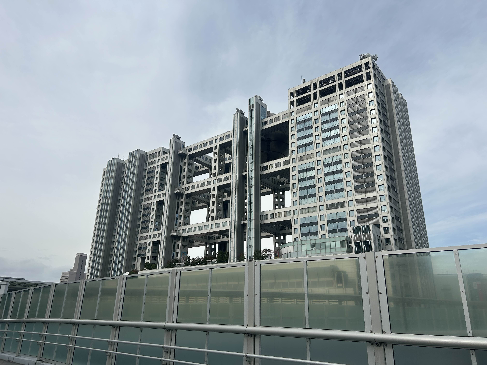
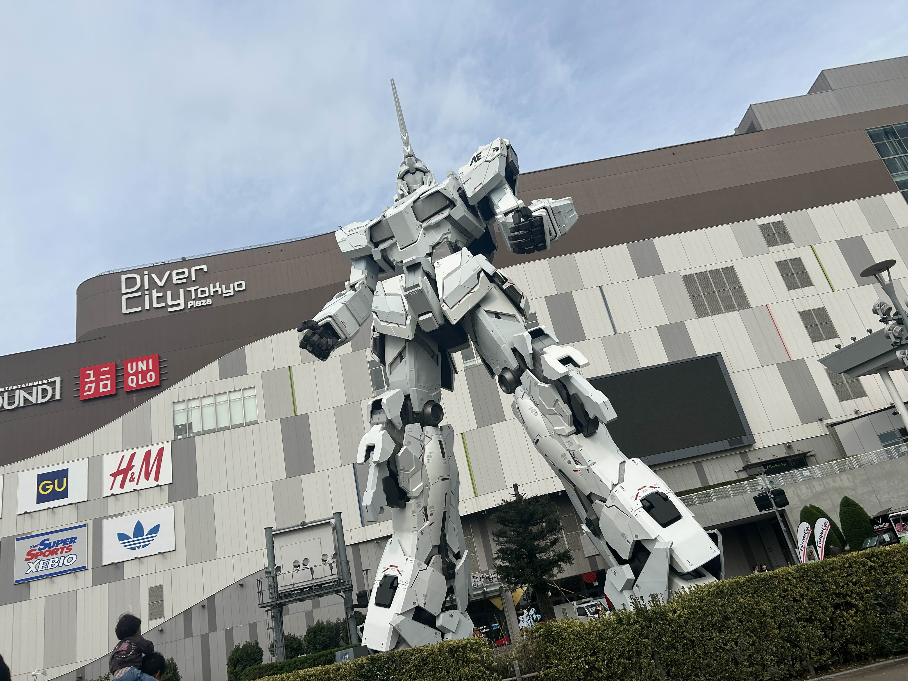
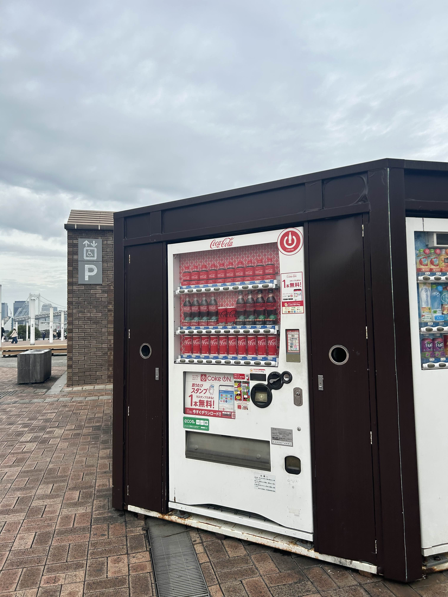
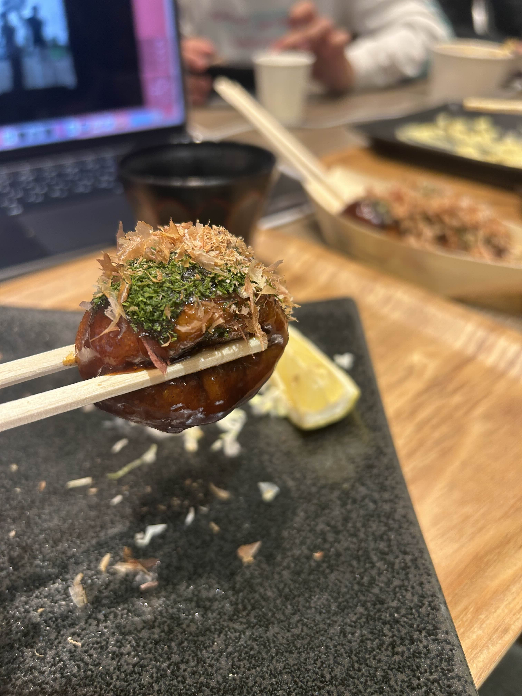
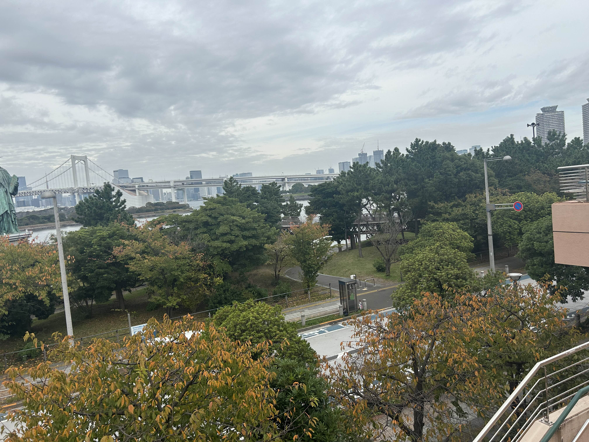
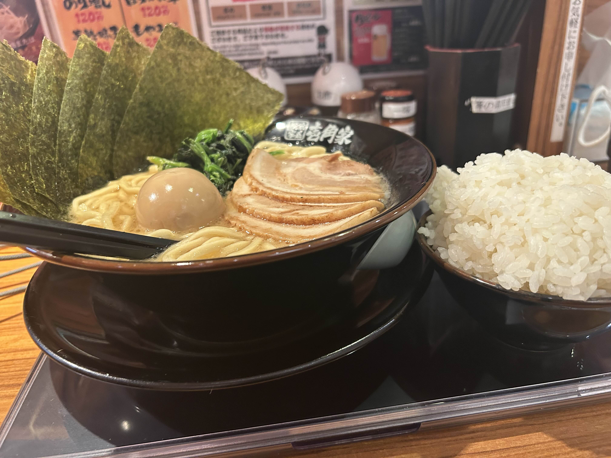
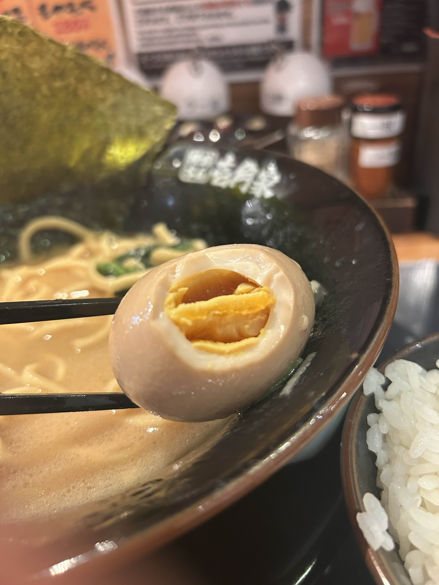

友達がガンダムが見たいぜ！といいお台場に来ました！

まずお台場について真っ先にガンダムベースに向かったのですが、まさかの予約になっていて、午後から解放という事実を知りました。

そしてガンダムベースの広場みたいなところに行き、ガンダムを撮影しました。

ある程度ガンダムを満喫して、適当に歩き回っていたら、とある自販機を見つけました。

なんと、コーラしか売っていない自販機でした。驚いて撮影したのですが、そこに売っているコーラが高すぎると思ったのが印象です。

そのあとは昼ご飯を食べに行きました。たこ焼きを食べました。

メジャーな銀だこですが、おいしかったです。

その後はお台場をプラプラして、適当に一枚撮りました(一切アングル考えずに唐突に撮影したもの)。

適当な割に綺麗な気は...しないですね。

そのあとは夜ご飯で壱角家に行き、MAXラーメン食べに行きました。

とてもおいしいですが、ご飯を友達にドアホのように盛り付けられ、後半が厳しかったです。

この卵がつらかった...。
