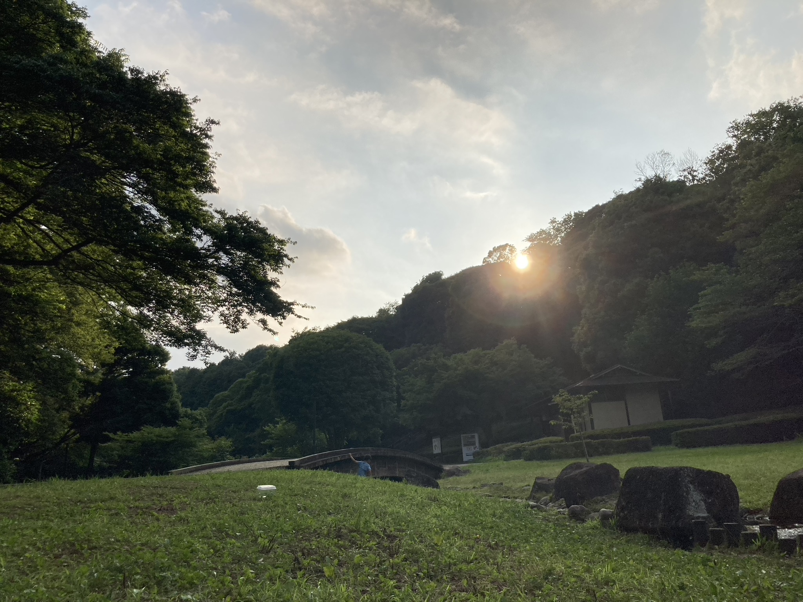
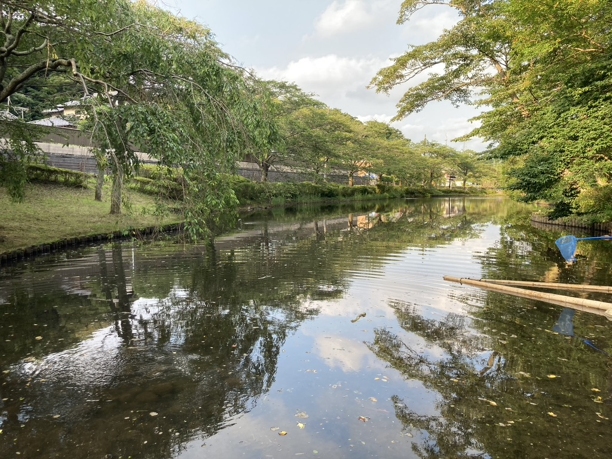
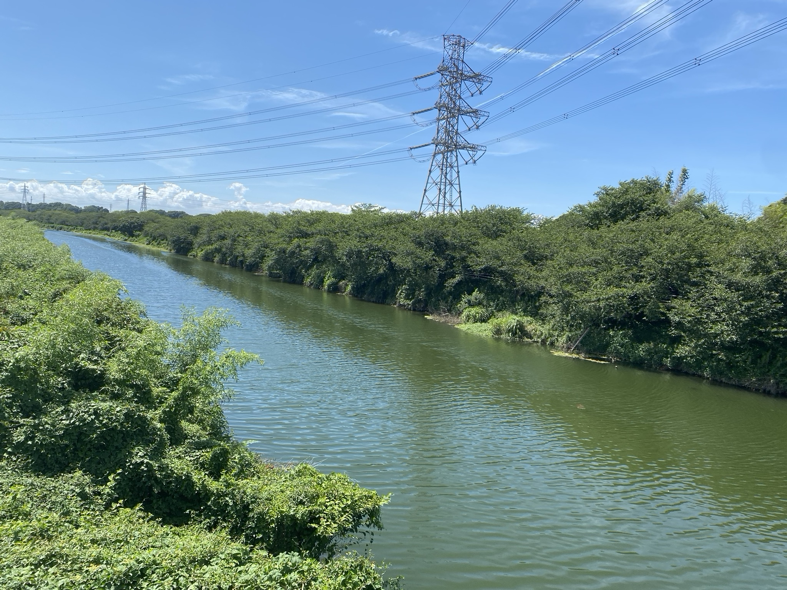
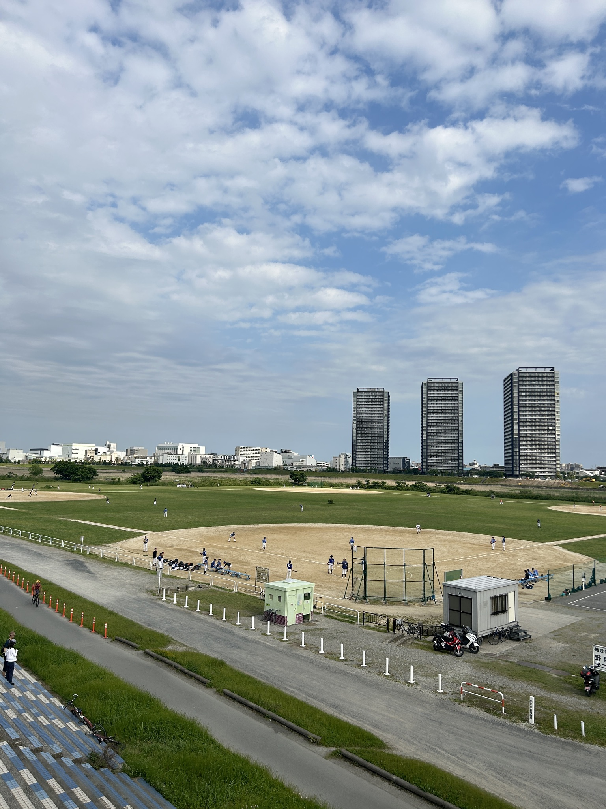

ネタがないから書いた記事なんて口が滑っても言えませんが、僕が何となくで撮影した風景を載せていきます。

まずは千葉のとある公園で撮った写真です。

すごくきれいなんですよ。光がいい感じです。ほかには...

これなんかはもう壁紙にしてもしばらく飽きないワンショット！実際にそこにいたときはめちゃめちゃ楽しかったです。

後は、千葉の橋を渡っているときの写真です。

これもすごくきれいで、一時期壁紙にしていました。

次に、ちょっとトレーニングがてら走ってた時に撮った１枚です。

実際に見たときは臨場感がすごかったのですが、写真で見ると...普通ですね。

最後にちょっとスクショで切り取ったものですが、千葉で撮ったものです。

左右の黒帯は置いておいて、これも嫌いではありません。
