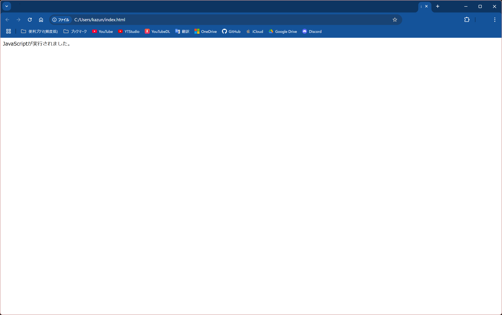
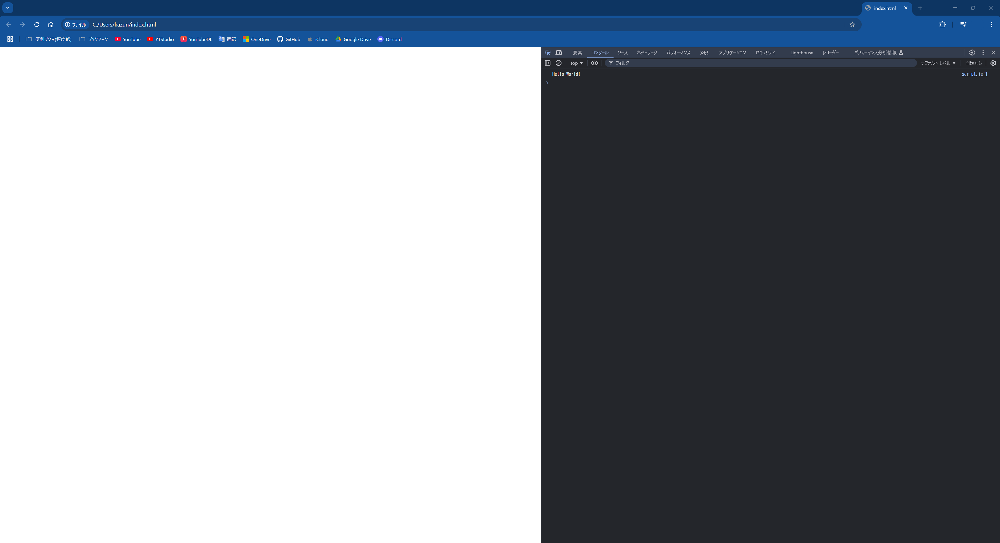

JavaScriptの書き方を解説します。JavaScriptの基礎や、持っておくべき知識を解説します。

筆者は企業に入ったことはありませんが、この際は気にせずご覧ください。お役に立てれば...。

## JavaScriptの仕組み
JavaScriptは拡張子「js」ファイルにプログラムを記入し、ブラウザでHTMLファイルを経由してjsファイルにアクセスすることで実行できます。

まずは例です。HTMLは最小構成で書きます。

```html
<!DOCTYPE html>
<html>
    <head>
        <meta charset="utf-8">
    </head>
    <body>
        <script src="script.js"></script>
    </body>
</html>
```

次にJavaScriptです。bodyタグに文字を表示させます。
```js
document.body.innerText = "JavaScriptが実行されました。";
```

これをHTMLは「index.html」、JavaScriptは「script.js」で保存し、htmlファイルを開くと、こうなるはずです。



まず、JavaScriptの実行方法を理解していただけたかと思います。では先ほどのscript.jsの内容を次のコードに置き換えてみましょう。
```js
console.log("Hello World!");
```
このコードは初心者のコード練習でメジャーのコードです。実際に実行し、DevToolsを開いて、コンソールを見てみると、次が表示されるはずです。



コンソール文はプログラムの検証の時に役立つので、覚えておきましょう。ちなみに、DevToolsはChromeの場合Ctrlキー+Shiftキー+Iキーで開くことができます。

JavaScriptは何も書かれていない空のファイルに１行プログラムを書くだけで実行することができます。この前提を理解してから次へ行きましょう。

## 変数を知る
JavaScriptは変数を定義する、という行為を当たり前のように行います。それらを予め覚える必要があります。
```js
// 固定変数(ほぼ書き換え不可)
const string1 = "固定変数";

// 可変変数(書き換え可)
let string2 = "可変変数";
let string2;

// 共通変数(個人的非推奨)
var string3 = "共通変数";
var string3;

// 関数(後述)
function func() {
    console.log("Hello World!");
}

// クラス(後述)
class foo {
    constructor() {}
}
```
以上が基本的に宣言できる種類です。一つずつ紹介していきます。

`const`は`abj`

## 最後に
この記事ではJavaScriptの解説をしました。この記事が気に入ったらこのサイトをブックマークしていただくか、[miharublog.uk](https://miharublog.uk)をブックマークしていただき、ほかの記事もぜひご覧ください。
