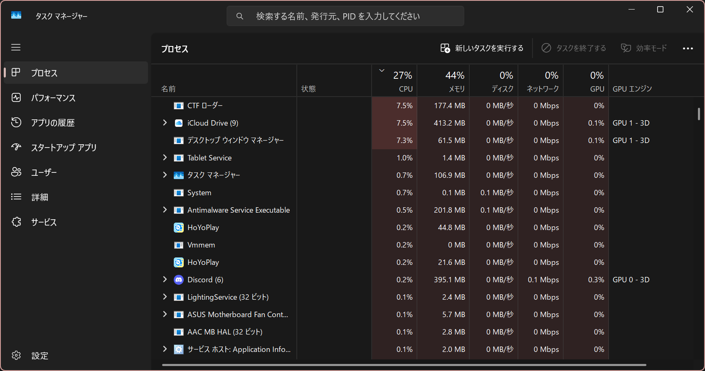
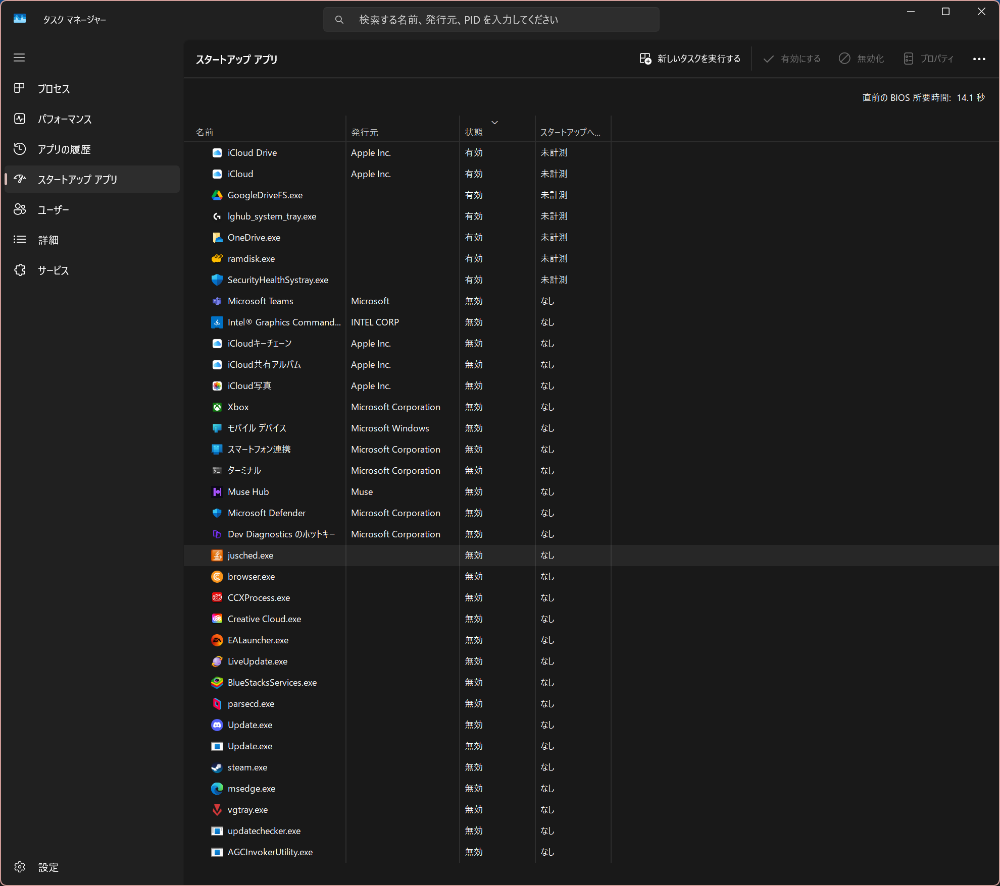

この記事ではWindowsを軽くする方法を解説します。少しWindowsが重くなってきたなと思ったらぜひご覧ください。

## デスクトップにはファイルを設置しない
デスクトップはパソコンを立ち上げたときに必ず読み込まれる部分です。ここにファイルを設置すると、読み込み時間が増え、起動時間が長くなってしまいます。

データをドキュメントフォルダに移動するなどし、デスクトップを空にすることをおすすめします。

他にもWindowsが標準で表示しているアイコンなどもありますが、もし利用していない場合は、それらも無効にしておきましょう。方法を解説します。

まず「設定」アプリを開き、「個人用設定」>「テーマ」>「関連設定」>「デスクトップ アイコンの設定」を順に選択します。

すると「デスクトップ アイコン」欄にチェックが入っているものがあるので、それらをすべて無効にします。そしてOKを押して完了です。

## スタートアップアプリを極力減らす
Windowsにはスタートアップという機能があり、パソコンを起動してから自動でアプリが起動するように設定することができます。しかし、それが悪さをして、起動してからずっとパソコンに負荷をかけてしまうことがあります。

無効にする方法を紹介します。まず、タスクバーで右クリックをします。

そして「タスクマネージャー」をクリックしてください。するとこのような画面が出ます。

Windows 10の場合

Windows 11の場合

Windows 10の場合は「スタートアップ」、Windows 11の場合は「スタートアップ アプリ」をクリックします。すると次の画面が表示されます。これはWindows 11の画面です。

筆者の環境ではたくさんのスタートアップが登録されていますが、「状態」を注目すると、有効だったり無効だったりします。

今回はそれを全て無効にしてください。そうすることで動作が快適になります。ちなみに、Windows セキュリティのアイコンがあるかと思いますが、それは無効にしてもセキュリティ上問題はないですが、有効でも構いません、ご自由に設定してください。

## 視差効果などを無効にする
視差効果をはじめ様々なWindowsのデザインをよくする機能があります。
- 透過効果
- アニメーション
- 文字を滑らかにする
- 壁紙

今回はそれらをすべて無効にしていきます。

## アプリは極力１つ以上開かない
アプリケーションを起動するとき、いつもブラウザとOffice系列のアプリを同時に開いたり、それと並行してエクスプローラーが開きっぱなしだったり、PDFアプリが開きっぱなしになったりしませんか？アプリは基本１つ以上開かないことをお勧めします。必要なアプリ以外閉じることを意識する必要があります。

例えば、書類を開きながらOfficeを開くのは大丈夫ですが、無駄にブラウザでたくさんタブを開いたりするのはいけません。

他の例だとチャットアプリと編集ソフトとブラウザを合計で３つ開くことがある方もいるかもしれませんが、作業の上で最も重要なアプリだけを開き、それ以外を閉じるようにする必要があります。

## 再起動を定期的に行う
再起動はWindowsにおいて最も動作を改善することができる方法です。何か作業が終わったら再起動をすることが大切です。

シャットダウンでも構いませんが、Windowsはシャットダウンより再起動の方が無駄なアプリのデータを削除したりすることがあるので、再起動をすることをおすすめします。

## 空き容量はなるべく多く作る
Windowsだけでなく全てのPCに言えることですが、空き容量はたくさん空けておいてください。少し大きな処理をするアプリを開いたときに容量が足りない場合、突然Windowsがフリーズしてしまう場合があります。

必要のないファイルを削除したり、外付けドライブにデータを移動して保管することをお勧めします。

## サービスを無効にする
Windowsは様々な拡張機能であったり、サービスや常駐プログラムをインストールすることができます。便利ではありますが、稀にPCの速度を落とす原因になったりするので、この機会に一度機能を整理してみてもよいかもしれません。

### クラウドストレージを全て無効にする
Windowsはクラウドストレージを長期間利用すると、速度が落ちる原因になったり、エクスプローラーがフリーズする原因になったりします。例をあげると、ミュージックファイルが入ったフォルダ等を開いた場合、ミュージックファイルの情報を取得するために長時間かかってしまい、1分間フリーズする場合などがあげられます。

筆者が重いと感じたクラウドストレージサービスをあげます。
- OneDrive: Windows標準なので安定しているかと思われますが、一部機能でフリーズが目立ち、無効化することで改善しました。
- iCloud Drive: 様々なプログラムで支障をきたしたり、ファイルが多すぎる場合に同期が１日以上止まってしまったりするために、利用を停止したことがあります。

他にもクラウドストレージはありますが、私が違和感あったのはこの２つです。

## デフラグ(ドライブの最適化)を行う
短期間に大量のファイルを移動した場合、PCの動作は急激に遅くなることがあります。その場合はWindows標準の「ドライブの最適化」を使い、最適化を行いましょう。

まず、エクスプローラーを開き、任意のドライブを選びます。そして右クリックしプロパティを開きます。

プロパティウィンドウから「ツール」>「ドライブの最適化とデフラグ」>「最適化」の順に選びます。するとドライブリストが出るので、全てのドライブを最適化しましょう。もしPCの動作が遅い場合、最適化には１時間かかったり、場合によっては１日かかる恐れもあります。スリープさせないように気を付けながら、気長に待ちましょう。

## 他社製セキュリティソフトを消す
Windowsには標準で「Windows セキュリティ」が搭載されています。筆者は多くのアプリに触れてきましたが、そのセキュリティソフトで十分だと思っています。

他社製のセキュリティソフトをあげると、「Norton」「ウイルスバスター」「Avast」などがあります。用途やPC初心者、ブラウザで不明なサイトを多く調べる方にはとても良いですが、そうでない方や、記事を読んだり、動画を見たりするだけであったり、インストールアプリを利用するだけなどの限定的な利用である場合は、他社製のセキュリティソフトを無効にしたり、アンインストールしたりすることをおすすめします。

## 最終手段
最終手段はクリーンインストールです。これが一番手っ取り早いです。

## 他にもやってほしいこと
この記事にたどり着いた方には次の記事もぜひご覧いただきたいです。この記事の解説通りにすることで、さらにPCを軽くすることができます。

- [Windowsシステム容量を削減する方法5選!](./htmlBlogSource/0.html) - 容量を削減することでPCの寿命を延ばしたり、メモリの動作が快適になるかもしれません。

## 最後に
この記事ではWindowsの動作を改善する方法を解説しました。この記事が気に入ったらこのサイトをブックマークしていただくか、[miharu.blog](https://miharu.blog)をブックマークしていただき、ほかの記事もぜひご覧ください。
